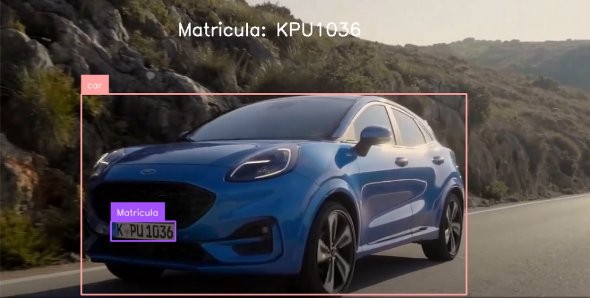

En construccion 🚧
<p align="center">

</p>

# Índice

* [Proyecto](#Proyecto)
* [Tegnologías Utilizadas](#Tegnologías-Utilizadas)
  * [YOLO10](#YOLO10)
  * [OpenCV](#OpenCV)
  * [RoboFlow](#RoboFlow)
  * [Tesseract OCR](#Tesseract-OCR)
* [Breve Explicación del Código](#Breve-Explicación-del-Código)
* [Estructura de Archivos](#Estructura-de-Archivos)
* [Recomendaciones](#Recomendaciones)
* [Autor](#Autor)

# Proyecto

El proyecto busca detectar el código de matrícula de vehículos de transpote terrestres, autos, motocicletas, buses y camiones. Para este fin se código se ayuda de la deteccion del vehículo y de la matricula.

Cabe aclarar que cuando se hacer referencia a placa,patente o matricula se está hablando de código de identificación vehicular.


<br>[Volver al Índice](#Índice)

# Tegnologías Utilizadas

## [Yolo10](https://docs.ultralytics.com/models/yolov10/)


### Instalación YOLO10

En poco tiempo se intalará de manera automática al instalar la librería ultralytics.

En mi caso tuve que instalarlo de la siguente manera:

```python
# Dentro de la carpeta del proyecto, corre lo siguente en la terminal.
git clone https://github.com/THU-MIG/yolov10.git 
cd yolov10 
pip install .
```


## [OpenCV](https://docs.opencv.org/4.x/)


## [RoboFlow - Universe](https://universe.roboflow.com/)


### [Dataset usado para las matrículas](https://universe.roboflow.com/put-poznan-6aps1/car_detect-chuwy)
### [dataset matriculas](https://universe.roboflow.com/put-poznan-6aps1/car_detect-chuwy)


## [Tesseract OCR](https://github.com/tesseract-ocr/tesseract)


<br>[Volver al Índice](#Índice)

# Breve Explicación del Código

Cabe destacar que el codigo realiza el proceso frame a frame, por lo que se decidió dejar el archivo [detector.ipynb](https://github.com/jrguignan/Proyecto-Deteccion_de_Matriculas/blob/main/detector.ipynb). La suma del analisis de estos frames generará el video de salida.

Se pasa el frame a analisar.

<p align="center">

</p>

Se corre el datasets de coco en YOLO, para detectar si hay un auto, motocicleta, bus o camión y se colocan las etiquetas de la detección en el frame.

<p align="center">

</p>

Al detectar algún vehiculo se procede a cortar el box de la detección para mejorar la deteccion de la placa, aunque no es necesario.

<p align="center">

</p>


A partir de la imagen recortada se detecta la matrícula y se coloca la etiqueta de la detección en el frame.

<p align="center">

</p>

Se recorta el box de la detección de la matrícula

<p align="center">

</p>

Se transforma la imagen a escala de grises para facilitar la detección del OCR

<p align="center">

</p>

Se imprime la deteccion del OCR en el frame, que en conjunto con las demas etiquetas muestran el frame final.

<p align="center">

</p>

La iteración de este proceso genera el análisis de un video o tambien podría ser el análisis  una camara en tiempo real.

# Estructura de Archivos

**carpeta models** -> Contiene los modelos entrenados en archivos .pt. Estos archivos son los valores de los peso y los bias de la red neuronal entrenada. Uno es el entreando por defecto con el dataset COCO y el otro es un dataset entrenado con un dataset sacado de roboflow  <br>

**carpeta videos** -> Contiene un video que se utilizó de prueba y el video de salida luego de la detección de la matrícula.<br>

**detector.ipynb** -> Archivo de jupyter que contiene el código para correr sobre un frame. Muestra paso a paso lo que hace el código. <br>

**detector.py** -> Archivo que contiene el código para correr sobre un video. <br>

**entrenamiento_colab.ipynb** -> Archivo de jupyter notebook que contiene el entrenamiento del dataset para detectar la matrículas a 40 épocas, en la plataforma de Google Colab.<br>

**requirements.txt** -> Archivo de texto que contiene las librerías utilizadas con sus versiones, en el caso de ultralytics(YOLO10), se instaló directo del reposiorio de GitHub porque ha la fecha de realización de este proyecto, tenía pocos días de su salida. <br>


<br>[Volver al Índice](#Índice)

# Recomendaciones

- El dataset de transporte
- El dataset de placa
- tracker
- OCR


<br>[Volver al Índice](#Índice)

# Autor

- José R. Guignan
- Mail: joserguignan@gmail.com
- Linkedin: [https://www.linkedin.com/in/jrguignan](https://www.linkedin.com/in/jrguignan)
