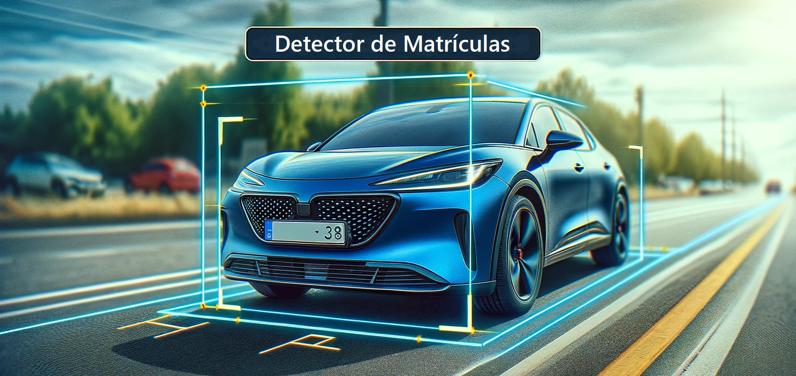
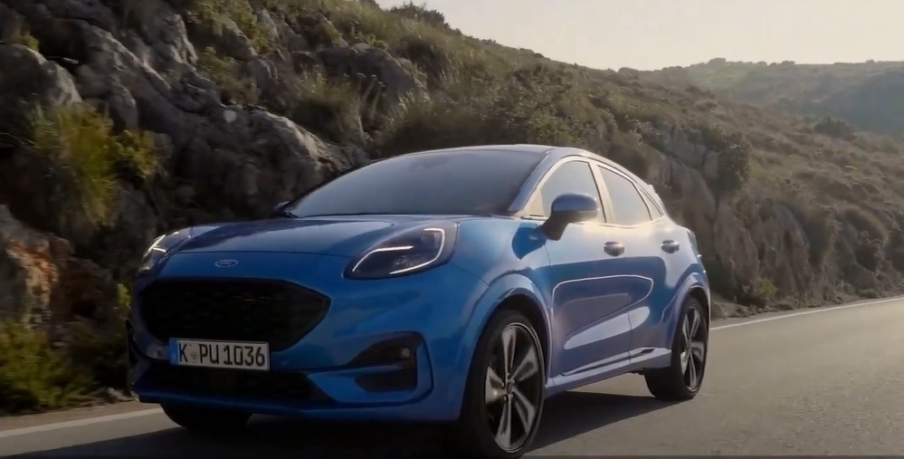
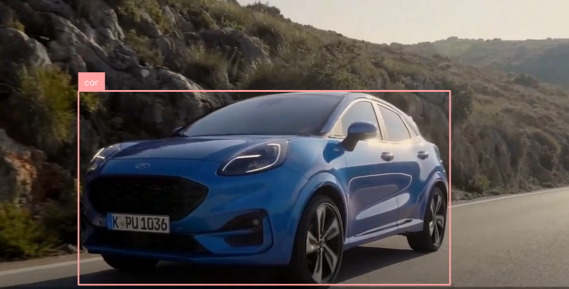
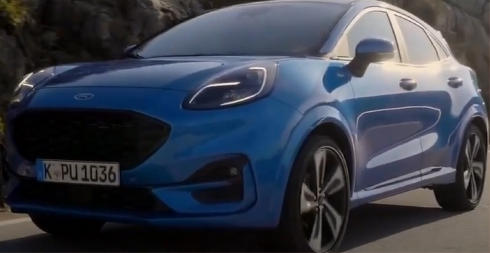
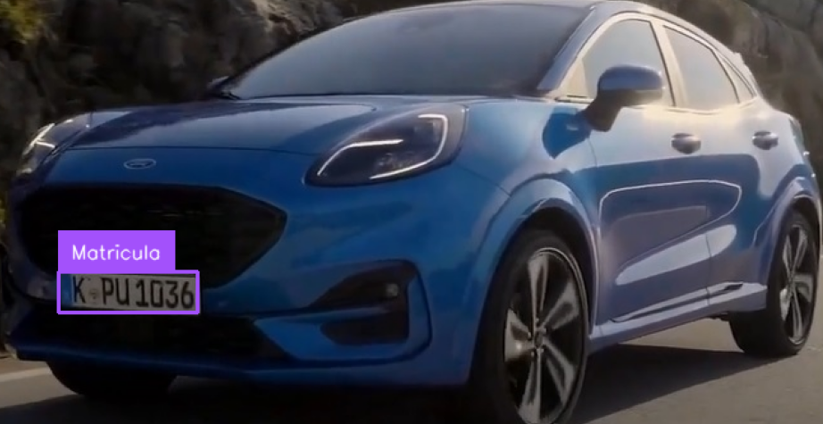
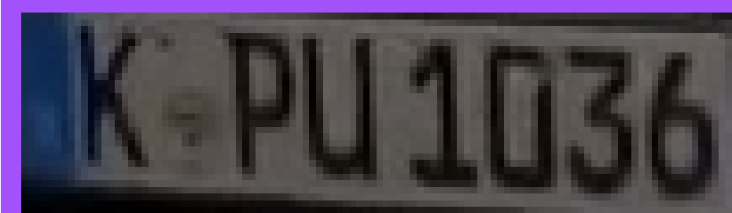
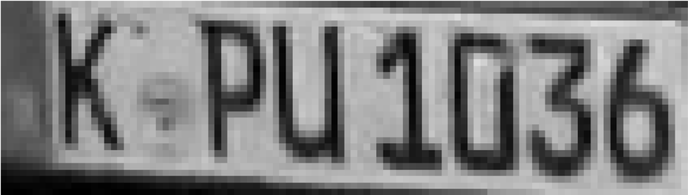
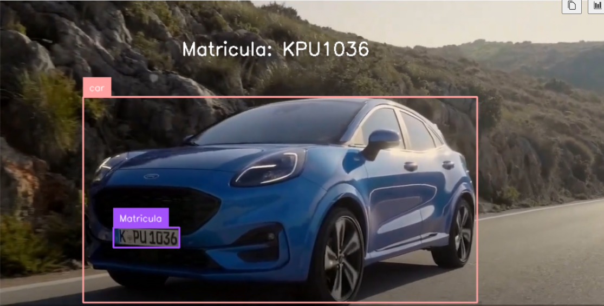

En construccion 🚧
<p align="center">

</p>

# Índice

* [Objetivo](#Objetivo)
* [Tegnologías Utilizadas](#Tegnologías-Utilizadas)
  * [YOLOv10](#YOLOv10)
  * [OpenCV](#OpenCV)
  * [RoboFlow](#RoboFlow)
  * [Tesseract OCR](#Tesseract-OCR)
* [Breve Explicación del Código](#Breve-Explicación-del-Código)
* [Estructura de Archivos](#Estructura-de-Archivos)
* [Recomendaciones](#Recomendaciones)
* [Autor](#Autor)

# Objetivo

El proyecto busca detectar el código de matrícula de vehículos de transpote terrestres, autos, motocicletas, buses y camiones. Para este fin el código utilizará la detección  de vehículos y  luego de la matricula con YOLO10.

Cabe aclarar que cuando se hacer referencia a placa, patente o matrícula se está hablando de código de identificación vehicular.


<br>[Volver al Índice](#Índice)

# Tegnologías Utilizadas

## [YOLOv10](https://docs.ultralytics.com/models/yolov10/)

YOLO (You Only Look Once) de Ultralytics es una arquitectura de red neuronal profunda diseñada para la detección de objetos en tiempo real. Utiliza un enfoque de regresión único que predice directamente las clases y las ubicaciones de los objetos en una imagen en una sola pasada, lo que lo hace extremadamente rápido y eficiente. Se usa en diversas aplicaciones como vigilancia, conducción autónoma, análisis de videos y cualquier tarea que requiera identificar y localizar objetos específicos dentro de imágenes o secuencias de video de manera rápida y precisa.

En nuestro caso se uso la versión nano de YOLO. Para el caso de la detección de los vehículos se utilizó el dataset preentrenado con COCO y para el caso de la detección de la matrícula se usó un dataset de RoboFlow, este se entrenó en YOLOv8 y se pudo correr sin problemas en YOLOv10, debido a que la página de RoboFlow-Universe no se a actualizado a YOLOv10.

### Instalación YOLO10
En el momento de la realización del proyecto, recién había salido YOLOv10, por lo que tuvo que instalar desde el repositorio de GitHub.

En poco tiempo se intalará de manera automática al instalar la librería ultralytics.

Se instaló de la siguente manera:

```python
# Dentro de la carpeta del proyecto, corre lo siguente en la terminal.
git clone https://github.com/THU-MIG/yolov10.git 
cd yolov10 
pip install .
```


## [OpenCV](https://docs.opencv.org/4.x/)

OpenCV (Open Source Computer Vision Library) es una biblioteca de software de código abierto especializada en visión por computadora y aprendizaje automático. Desarrollada inicialmente por Intel, está escrita en C++ pero también tiene interfaces para Python y Java, entre otros lenguajes. OpenCV ofrece una amplia gama de herramientas y funciones para la captura, procesamiento y análisis de imágenes y videos. Se utiliza en aplicaciones como el reconocimiento facial, la detección de objetos, la segmentación de imágenes, el seguimiento de movimientos, la reconstrucción 3D y muchas otras tareas en los campos de la visión por computadora y la inteligencia artificial. Su capacidad para manejar tareas complejas de procesamiento de imágenes de manera eficiente la convierte en una herramienta valiosa para investigadores y desarrolladores en estas áreas.


## [RoboFlow](https://universe.roboflow.com/)

Es una plataforma integral diseñada para facilitar el desarrollo de aplicaciones de visión por computadora. Proporciona herramientas para gestionar y mejorar datasets de imágenes, incluyendo la anotación, el aumento de datos y la exportación a formatos compatibles con diversas arquitecturas de modelos de aprendizaje profundo, como YOLO, TensorFlow, y PyTorch. Roboflow simplifica el proceso de preparar los datos para entrenar modelos de reconocimiento de objetos, clasificación de imágenes y segmentación, permitiendo a los desarrolladores centrarse en el diseño y optimización de sus modelos en lugar de en las tareas repetitivas y técnicas asociadas con la gestión de datos.

#### [Dataset matrículas directo para descargar](https://drive.google.com/file/d/14F8udJ3bpF8evlwJESyYtV7JOL2QB51C/view?usp=sharing)

#### [Dataset matrículas - Universe RoboFlow](https://universe.roboflow.com/put-poznan-6aps1/car_detect-chuwy)

El entrenamiento del dataset de matrículas se realizo en YOLOv8 devido a que al descargar de RoboFlow aún no se puede descargar en formato YOLOv10. De igual manera funcionó bien al correr en YOLOv10.


## [Tesseract OCR](https://github.com/tesseract-ocr/tesseract)

Tesseract OCR (Optical Character Recognition) es un motor de reconocimiento óptico de caracteres de código abierto desarrollado inicialmente por Hewlett-Packard. Este software permite convertir imágenes de texto impreso o manuscrito en texto digital editable. Es altamente configurable y soporta múltiples idiomas, lo que lo hace ideal para aplicaciones como la digitalización de documentos, el procesamiento de formularios, la extracción de datos de imágenes y la lectura automática de matrículas. Tesseract OCR es ampliamente utilizado en proyectos de digitalización de archivos históricos, aplicaciones móviles de escaneo de texto y sistemas de automatización de datos.


Para utilizar este OCR se debe insatalar un archivo en la computadora y tambien la librería **pytesseract** para conectarse con el a través de python.
[Tesseract-OCR-5.3.4.20240503-64bits](https://drive.google.com/file/d/14vVHnb6rZg3xkgkEJf9m3_0SKiwkY_gd/view?usp=sharing)


<br>[Volver al Índice](#Índice)

# Breve Explicación del Código

Cabe destacar que el codigo realiza el proceso frame a frame, por lo que se decidió dejar el archivo [detector.ipynb](https://github.com/jrguignan/Proyecto-Deteccion_de_Matriculas/blob/main/detector.ipynb), tambien para facilitar en el entendimiento del código del detector. 

La suma del analisis de estos frames generará el video de salida.

Se pasa el frame a analizar.

<p align="center">

</p>

Se corre modelo entrenado con el dataset de coco en YOLO, para detectar si hay un auto, motocicleta, bus o camión y se colocan las etiquetas de la detección en el frame.

<p align="center">

</p>

Al detectar algún vehiculo se procede a cortar el box de la detección para mejorar la deteccion de la placa, aunque no es necesario, mejora la detección de la matrícula.

<p align="center">

</p>


A partir de la imagen recortada se detecta la matrícula y se coloca la etiqueta de la detección en el frame.

<p align="center">

</p>

Se recorta el box de la detección de la matrícula

<p align="center">

</p>

Se transforma la imagen a escala de grises para facilitar la detección del OCR

<p align="center">

</p>

Se imprime la deteccion del OCR en el frame, que en conjunto con las demas etiquetas muestran el frame final.

<p align="center">

</p>

La iteración de este proceso genera el análisis de un video o también podría ser el análisis  una cámara en tiempo real.

<br>[Volver al Índice](#Índice)

# Estructura de Archivos

**carpeta models** -> Contiene los modelos entrenados en archivos .pt. Estos archivos son los valores de los peso y los bias de la red neuronal entrenada. Uno es el entreando por defecto con el dataset COCO y el otro es un modelo entrenado con un dataset sacado de RoboFlow.  <br>

**carpeta videos** -> Contiene un video que se utilizó de prueba y el video de salida luego de la detección de la matrícula.<br>

**detector.ipynb** -> Contiene el código para correr sobre un frame. Muestra paso a paso lo que hace el código. <br>

**detector.py** -> Contiene el código para correr sobre un video. <br>

**entrenamiento_colab.ipynb** -> Contiene el entrenamiento del dataset para detectar la matrículas a 40 épocas, se realizó en la plataforma de Google Colab, por ser más potente que la computadora donde se desarolló el proyecto.<br>

**requirements.txt** -> Archivo de texto que contiene las librerías utilizadas con sus versiones, en el caso de ultralytics (YOLO10), se instaló directo del reposiorio de GitHub porque ha la fecha de realización de este proyecto, tenía pocos días de su salida. <br>


<br>[Volver al Índice](#Índice)

# Recomendaciones

- Es más apropiado usar modelos entrenados con datasets de imágenes prácticas, que se aproximen a las que se usarán en la detección. Esto mejora en gran medida la detección. 

- Al analizar videos largos y con detecciones continuas de varios vehiculos es necesario utilizar un tracker en el código.

- Se puede mejorar el tratamiento previo de la imagen, antes de usar el OCR , esto mejoraría la lectura que hace tesseract-OCR.


<br>[Volver al Índice](#Índice)

# Autor

- José R. Guignan
- Mail: joserguignan@gmail.com
- Linkedin: [https://www.linkedin.com/in/jrguignan](https://www.linkedin.com/in/jrguignan)
